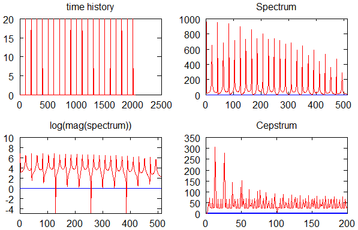

# Cepstrum - Detect Fundamental Frequency in Speech
 

1. Run referent tool (Praat) on a test speech signal, log detected Fundamental Frequency F0 to file and load them in MATLAB.  
2. In MATLAB, use Cepstrum, Treshold and Filtering to segment the voiced speech and detect Fundamental Frequency F0.  
3. Compare graphs of detected F0. 

### Keywords:  
> Speech Processing, Cepstrum, Fundamental Frequency, Praat, MATLAB  

### Table of Contents (Wiki)
[Wiki Home](https://github.com/etfovac/cepstrum/wiki)  
[Overview](https://github.com/etfovac/cepstrum/wiki/Overview)  
[Notes](https://github.com/etfovac/cepstrum/wiki/Notes)  
[Examples](https://github.com/etfovac/cepstrum/wiki/Examples)  
[References](https://github.com/etfovac/cepstrum/wiki/References)  

### Screenshots 

 
 
 
 
 
 
 
Cepstrum quick reminder:   

[cepstrum](https://github.com/etfovac/cepstrum) is maintained by [etfovac](https://github.com/etfovac).
